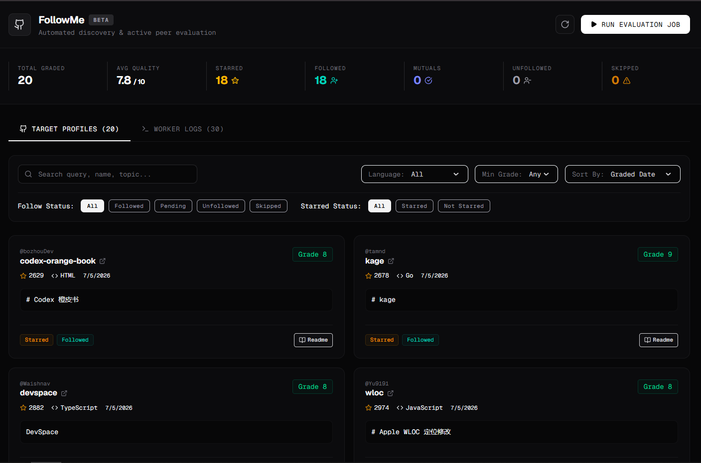

# FollowMe

Automated GitHub repo discovery, NVIDIA NIM LLM grading, and auto follow/star tool

## Dashboard

## How It Works

1. Discovery: Scheduled GitHub Actions workflow searches GitHub for active repositories created in the last 7 days matching targeted topic tags.
2. **AI Evaluation**: Fetches the README snippet and submits it to **NVIDIA NIM** (`meta/llama-3.1-8b-instruct`), grading the repository from 1 to 10 with a focus on student learning effort, original prototypes, and community builders.
3. **Smart Follow Filter**: Filters out "ego" developer accounts. Follows are executed only if the target user has a peer-profile signature (20-500 followers, following > 20, ratio 0.5-2.0, account age > 6 months). High-profile accounts are starred but skipped for follows.
4. **Data Sync**: Stores evaluation history, grades, actions, skip logs, and follow statuses in Supabase.
5. Periodic Cleanup: A GitHub Actions workflow triggers every 6 hours, checking all auto-followed accounts. If they fail to follow back within 3 days, it automatically unfollows them to maintain healthy account statistics.

## Targeting Guidelines
Follows are filtered through active peer criteria:
- **Primary Targeting**: `followers: 20–500`, `following > 20`, `followers/following: 0.5–2.0`, and `age > 6 months`.
- **Celebrity Bypass (Skip Follow / Star Only)**: Triggered if `followers > 500` and `following < 10`.

## Architecture

- **Worker:** Node.js + Express on Render, triggered on-demand via its /run endpoint
- **Scheduler:** GitHub Actions workflows (discovery + cleanup, every 6 hours)
Grading Engine: NVIDIA NIM LLM Integration
- **Storage Layer:** Supabase PostgreSQL database
- **Web Console:** Next.js 15 UI with monochrome design dashboard on Vercel

## Live Endpoints

- **Dashboard**: https://followme-mads.vercel.app
- **Worker status**: https://followme-gg6q.onrender.com/health
