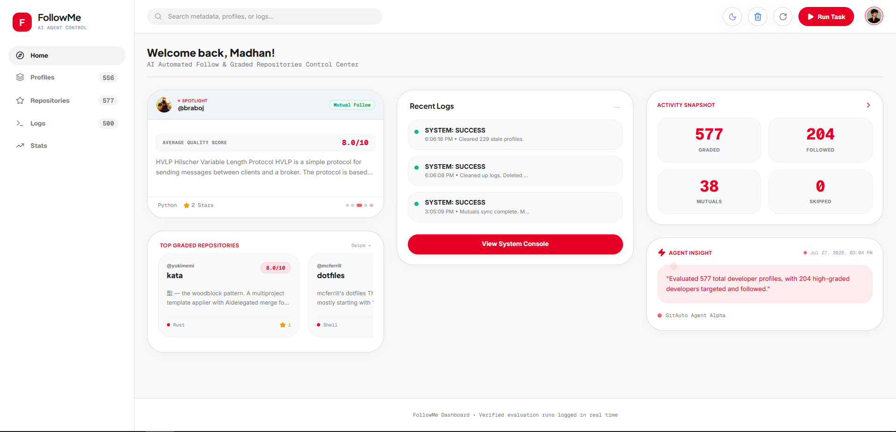

# FollowMe

Automated GitHub repo discovery, NVIDIA NIM LLM grading, and auto follow/star tool


## Dashboard



## How It Works

1. **Discover**: Scans GitHub every 6 hours for new repos created in the last 7 days.
2. **AI Grade**: Evaluates READMEs using **NVIDIA NIM** (`meta/llama-3.1-8b-instruct`), scoring repos (1–10) based on student effort, originality, and community impact.
3. **Smart Filter**: Targets peer developers (20–500 followers, balanced ratios, >6-month-old accounts). High-profile users are starred, not followed.
4. **Sync**: Stores scores, actions, logs, and follow states in Supabase.
5. **Auto-Cleanup**: Unfollows accounts after 3 days if they don't follow back to keep stats clean.

## Architecture

- **Worker:** Node.js + Express on Render, triggered on-demand via its /run endpoint
- **Scheduler:** GitHub Actions workflows (discovery + cleanup, every 6 hours)
Grading Engine: NVIDIA NIM LLM Integration
- **Storage Layer:** Supabase PostgreSQL database
- **Web Console:** Next.js 15 UI with monochrome design dashboard on Vercel

## Self-Hosting & Deployment Guide

> [!TIP]
> **Modular Architecture:** The stack below (Supabase + Render + Vercel) reflects my personal setup for low overhead, but the worker and dashboard are decoupled. Feel free to swap in your preferred database, host, or framework!

Follow this guide to spin up your own instance of **FollowMe**.

### 1. Prerequisites & API Keys

Before starting, gather the following credentials:

* **GitHub Personal Access Token (PAT):** Create one in GitHub Settings -> Developer Settings -> Personal Access Tokens (Fine-grained or Classic). Needs `user:follow`, `public_repo`, and `read:user` permissions.
* **NVIDIA NIM API Key:** Get a free key at [build.nvidia.com](https://build.nvidia.com/).
* **Supabase Keys:** Create a free project at [supabase.com](https://supabase.com/). Go to **Project Settings** -> **API** to copy your:
  * `Project URL` (e.g., `https://your-project.supabase.co`)
  * `anon` / `public` API Key

> [!NOTE]
> Make sure your GitHub Personal Access Token has `user:follow`, `public_repo`, and `read:user` permissions.

> [!WARNING]
> Keep your `SUPABASE_ANON_KEY` and `GITHUB_TOKEN` secure and never commit them directly to the repository.

---

### 2. Database Setup (Supabase)

1. Open your **Supabase Dashboard** -> **SQL Editor**.
2. Click **New Query**.
3. Copy the contents of [`schema.sql`](./schema.sql) from this repository, paste it into the editor, and click **Run**.

*(This initializes the required tables for evaluation history, follow tracking, and queue state).*

---

### 3. Deploy the Background Worker (Render)

1. Create a new **Web Service** on [Render](https://render.com/) and connect your repository.
2. Set the **Root Directory** to `worker`.
3. Reference [`worker/.env.example`](./worker/.env.example) and add the required **Environment Variables**:

```env
PORT=8000
WORKER_SECRET=your_worker_secret
GITHUB_TOKEN=your_github_personal_access_token
GITHUB_USERNAME=your_github_username
NVIDIA_API_KEY=your_nvidia_api_key
SUPABASE_URL=https://your-project.supabase.co
SUPABASE_ANON_KEY=your_supabase_anon_key
```

4. Click Deploy Web Service and copy your public service URL (e.g., https://your-worker.onrender.com).

---

### 4. Deploy the Web Dashboard (Vercel)
1. Import your repository into [Vercel](https://vercel.com).
2. Set the **Root Directory** to `dashboard`.
3. Reference [`dashboard/.env.example`](./dashboard/.env.example) and add the required **Environment Variables**:

```env
NEXT_PUBLIC_SUPABASE_URL=https://your-project.supabase.co
NEXT_PUBLIC_SUPABASE_ANON_KEY=your_supabase_anon_key
SUPABASE_SERVICE_ROLE_KEY=your_supabase_service_role_key
NEXT_PUBLIC_WORKER_URL=https://your-worker.onrender.com
WORKER_SECRET=your_worker_secret
GITHUB_TOKEN=your_github_personal_access_token
```

4. Click Deploy.

---

### 5. Automate with GitHub Actions

To enable automated background execution:

1. Go to your GitHub Repository -> **Settings** -> **Secrets and variables** -> **Actions**.
2. Add the following **Repository Secrets**:
   * `WORKER_URL`: Your deployed Render worker endpoint with `/run` appended (e.g., `https://your-worker.onrender.com/run`)
   * `WORKER_SECRET_KEY`: *(Optional)* Secret key if you secured your `/run` route.
3. Go to the **Actions** tab in your repository and enable the workflows. The scheduler will now trigger discovery automatically every 6 hours.

## Live Links
* **Dashboard Demo**: [Launch Demo Dashboard ↗](https://followme-demo.vercel.app)

* **Worker Health Check**: [Live Health Check ↗](https://followme-gg6q.onrender.com/health) *(Note: May take ~30s if waking from sleep)*

## License
Distributed under the [MIT License](LICENSE)
